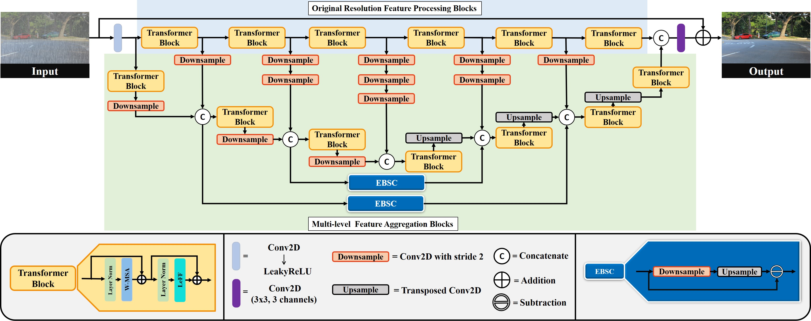

# Unified Transformer Network for Multi-Weather Image Restoration [ECCVW-2022]
[Poster](https://github.com/AshutoshKulkarni4998/UMWTransformer/tree/main/images/ECCV22_Poster.pdf)

Inference code for the manuscript "Unified Transformer Network for Multi-Weather Image Restoration"
## Abstract
Vision based applications routinely involve restoration as a preprocessing step, making it impossible to have separate architectures for different types of weather restoration. But, most of the existing methods focus on weather specific application. Further, the methods for multi-weather image restoration have high computational constraints. To overcome these limitations, we propose a compact transformer based network, with 4.5M parameters (1/10th of the existing method) for unified (simultaneous) removal of rain, snow and hazy effect with single set of trained parameters. We propose two parallel streams to handle the degradations: First, original resolution transformer stream (ORTS) focuses mainly on extracting fine level features through original scales of the inputs. Second, multi-level feature aggregation stream (MFAS) learns different sizes of the weather degradations. Further, it also uses coarse outputs from the first stream and utilizes edge boosting skip connections (EBSC) for propagating crucial edge details essential for image restoration. Finally, we present a memory replay training approach for generalization of the proposed network on multi-weather degraded scenarios. Substantial experiments on synthetic as well as realworld images, along with extensive ablation studies, demonstrate that the proposed method performs competitively with the existing methods for multi-weather image restoration.
<p align="left">
  
</p>

Arrange the testing images in the format:

```
    UMWTransformer-main
    ├── testing_data
    |   |── input         # degraded images (In realworld case, keep the same image in both the folders)
    |   |── gt            # clean images
```
Download the pretrained checkpoint from [here.](https://drive.google.com/drive/folders/1Uc3V0ZdDT9hST6PfhDffndgPnQd1Yyg6?usp=sharing/)

To run the inference code, run the following commands:

```   
python test.py
```
### Acknowledgement:

This code is derived from [UFormer](https://github.com/ZhendongWang6/Uformer).
